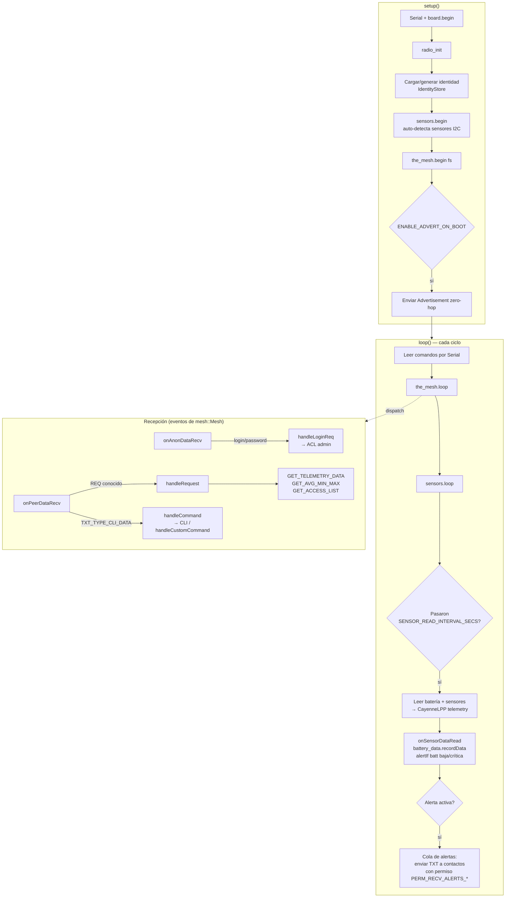
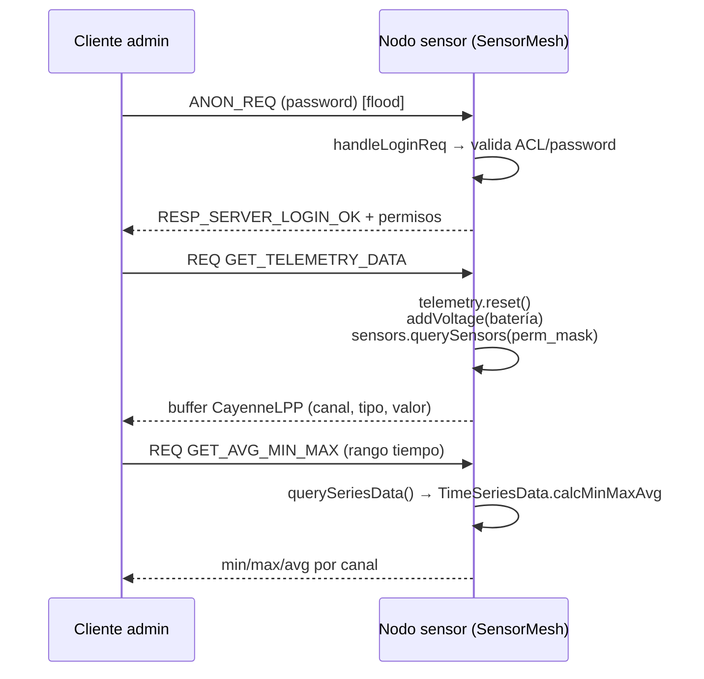

# Firmware de nodo sensor (`examples/simple_sensor`)

`examples/simple_sensor` es el firmware de referencia para un nodo **sensor**
de MeshCore: se anuncia en la malla, publica telemetría (batería + sensores
ambientales por I2C) y expone comandos remotos autenticados para consultarla
o para pasar comandos CLI comunes.

- **Target de hardware documentado aquí**: Seeed XIAO nRF52840 + módulo LoRa
  SX1262 (entorno PlatformIO `variants/xiao_nrf52`), pero el mismo código
  corre sin cambios en cualquier placa con un env `<placa>_sensor` (p. ej.
  `xiao_s3`, `rak4631`, `heltec_v3`, ...).
- **Firmware/env**: `Xiao_nrf52_sensor` (`variants/xiao_nrf52/platformio.ini`).
- **Punto de personalización**: clase `MyMesh : SensorMesh` en
  `examples/simple_sensor/main.cpp` — ahí se define qué se mide, qué alertas
  se disparan y los comandos CLI propios del ejemplo.

## Archivos

| Archivo | Rol |
|---|---|
| `main.cpp` | `setup()`/`loop()`. Inicializa radio, filesystem, identidad (keypair), sensores y la malla. Implementa `MyMesh` con la lógica específica de este ejemplo (alertas de batería). |
| `SensorMesh.h/.cpp` | Clase base reutilizable: protocolo de malla (`mesh::Mesh`), CLI (`CommonCLI`), control de acceso (`ClientACL`), telemetría CayenneLPP, cola de alertas y persistencia. |
| `TimeSeriesData.h/.cpp` | Buffer circular de valores (float) con timestamp, usado para históricos (ej. voltaje de batería cada 5 min / 24h). |
| `UITask.h/.cpp` | Pantalla opcional (solo si `DISPLAY_CLASS` está definido) — logo de arranque + info de nodo/radio. En la XIAO nRF52 va con `DISPLAY_CLASS=NullDisplayDriver` (sin pantalla física). |

## Cómo funciona

### Arranque y bucle principal



Puntos clave:

- Cada `SENSOR_READ_INTERVAL_SECS` (60s por defecto) se leen batería y
  sensores ambientales activos (`ENV_INCLUDE_*`) y se llama a
  `onSensorDataRead()`, el hook que `main.cpp` usa para registrar el
  histórico de batería y evaluar los triggers `low_batt`/`critical_batt`.
- Las alertas se encolan (máx. `MAX_CONCURRENT_ALERTS = 4`) y se reintentan
  contacto por contacto hasta recibir ACK o agotar los reintentos
  (`ALERT_ACK_EXPIRY_MILLIS`).
- Todo lo que no es específico del sensor (routing, ACL, CLI común,
  persistencia en filesystem) vive en `SensorMesh`, no en `main.cpp`.

### Petición remota de telemetría



Un cliente admin debe autenticarse una vez (`ANON_REQ` con password, o estar
ya en el ACL) antes de poder pedir `GET_TELEMETRY_DATA` / `GET_AVG_MIN_MAX` /
`GET_ACCESS_LIST`. Los timestamps se validan contra `last_timestamp` del
contacto para prevenir ataques de repetición.

## Build para XIAO nRF52840

La placa ya tenía soporte completo en `variants/xiao_nrf52` (radio SX1262,
I2C en `D6`/`D7`, GPIO, RTC) a través del env base `[Xiao_nrf52]`, pero le
faltaba un env específico para compilar este ejemplo — a diferencia de otras
placas que ya tienen `<placa>_sensor` (`xiao_s3`, `rak4631`, `heltec_v3`...).
Se añadió:

```ini
; variants/xiao_nrf52/platformio.ini
[env:Xiao_nrf52_sensor]
extends = Xiao_nrf52
build_flags =
  ${Xiao_nrf52.build_flags}
  -D ADVERT_NAME='"Xiao_nrf52 Sensor"'
  -D ADVERT_LAT=0.0
  -D ADVERT_LON=0.0
  -D ADMIN_PASSWORD='"password"'
;  -D MESH_PACKET_LOGGING=1
;  -D MESH_DEBUG=1
build_src_filter = ${Xiao_nrf52.build_src_filter}
  +<../examples/simple_sensor>
```

Compilar y flashear:

```sh
pio run -e Xiao_nrf52_sensor -t upload
```

Verificado con `pio run -e Xiao_nrf52_sensor` (build limpio, sin errores):
firmware.elf ≈ 379 KB de flash (de 792 KB disponibles) y RAM (`data`+`bss`)
cerca del límite reportado por PlatformIO para esta placa (el softdevice
S140 reserva parte de los 256 KB físicos) — sin overflow de linker, pero
conviene vigilar el `%RAM` si se agregan más sensores (`ENV_INCLUDE_*`) o
librerías al env.

### Notas de la config heredada de `Xiao_nrf52`

- I2C ya inicializado por el firmware (`PIN_WIRE_SCL=D6`, `PIN_WIRE_SDA=D7`)
  — los sensores ambientales soportados (`ENV_INCLUDE_AHTX0`, `BME280`,
  `BMP280`, `SHTC3`, `SHT4X`, `LPS22HB`, `INA3221/219/226/260`, `MLX90614`,
  `VL53L0X`, `BME680`, `BMP085`) se auto-detectan en `sensors.begin()` sin
  configuración adicional.
- `DISPLAY_CLASS=NullDisplayDriver`: la XIAO nRF52840 no trae pantalla; el
  código de `UITask` queda compilado pero inactivo.
- GPS deshabilitado por defecto (`-UENV_INCLUDE_GPS`), coherente con que la
  placa no trae receptor GPS integrado.
